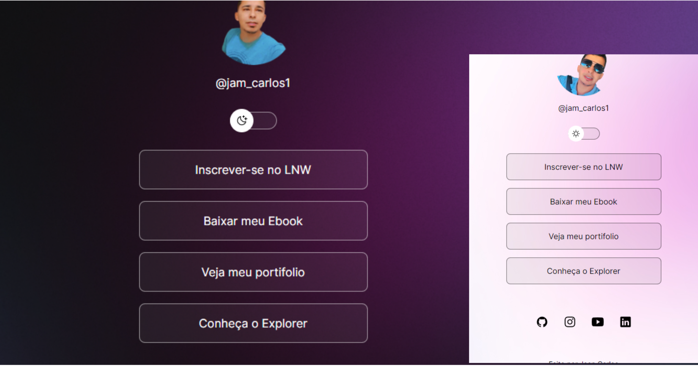

<h1 align="center"> DevLinks </h1>

Projeto desenvolvido com base no curso discover, promovido pela Rocketseat ensino de tecnologias WEB.

  <a href="#-tecnologias">Tecnologias</a>&nbsp;&nbsp;&nbsp;|&nbsp;&nbsp;&nbsp;
  <a href="#-projeto">Projeto</a>&nbsp;&nbsp;&nbsp;|&nbsp;&nbsp;&nbsp;

 

  

## 🚀 Tecnologias

Esse projeto foi desenvolvido com as seguintes tecnologias:

- HTML e CSS
- JavaScript
- Git e Github

## 💻 Projeto

DevLinks acesso a diversos links como instagram, linkedln, github, youtube.

Feito por Jean Carlos